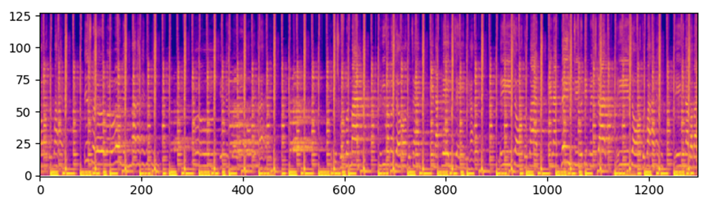
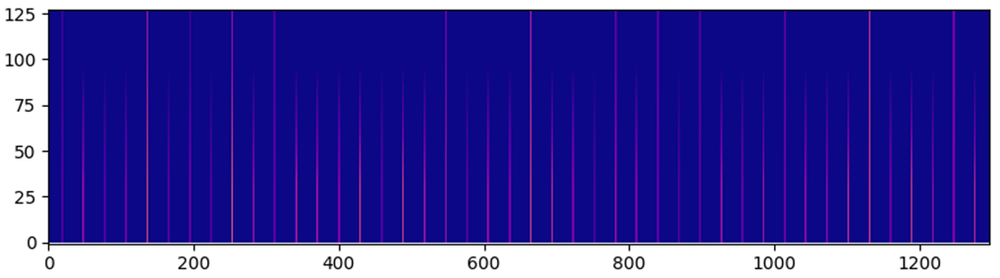
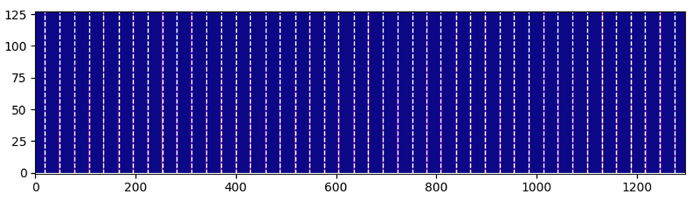

Detecting temporal events in audio requires models that capture both fine-grained local patterns and long-range sequential dependencies. Temporal Convolutional Networks (TCNs), via dilated convolutions, efficiently model local structure. Transformers excel at global sequence modelling. This work combines them in a dual-path parallel architecture for beat tracking, where each branch specialises without interference.

Post-processing uses a Dynamic Bayesian Network (DBN) with Viterbi decoding to align predictions with valid beat interval constraints. The model is evaluated across diverse public datasets spanning varied genres and tempos, matching state-of-the-art performance with a significantly smaller parameter count. Grad-CAM visualisations provide interpretability into which input regions drive predictions.

*Fig. Spectrogram, ground truth annotation and generated activations*

Keywords: temporal event detection; temporal convolutional network (TCN); transformers; sequence modelling; signal processing
