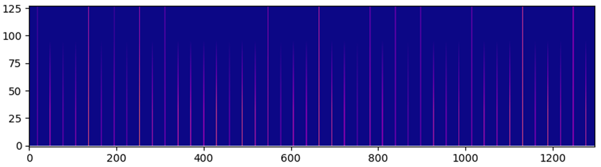

The Transformer, a deep learning architecture, has shown exceptional adaptability across fields, including music information retrieval (MIR). Transformers excel at capturing global, long-range dependencies in sequences, which is valuable for tracking rhythmic patterns over time. Temporal Convolutional Networks (TCNs), with their dilated convolutions, are effective at processing local, temporal patterns with reduced complexity. Combining these complementary characteristics, global sequence modeling from Transformers and local temporal detail from TCNs enhances beat tracking while reducing the model’s overall complexity.

To capture beat intervals of varying lengths and ensure optimal alignment of beat predictions, the model employs a Dynamic Bayesian Network (DBN), followed by Viterbi decoding for effective post-processing. This system is evaluated across diverse public datasets spanning various music genres and styles, achieving performance on par with current state-of-the-art methods yet with fewer trainable parameters. Additionally, we also explore the interpretability of the model using Grad-CAM to visualize the model’s learned features, offering insights into how the TCN-Transformer hybrid captures rhythmic patterns in the data.

*Fig. Spectrogram, ground truth annotation and generated activations*

Keywords: beat tracking; temporal convolutional network (TCN); transformers; music information retrieval (MIR)
