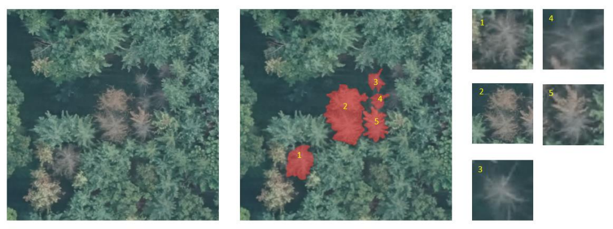
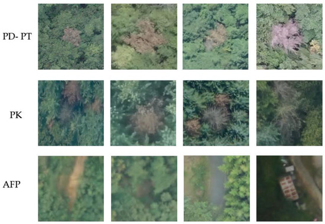
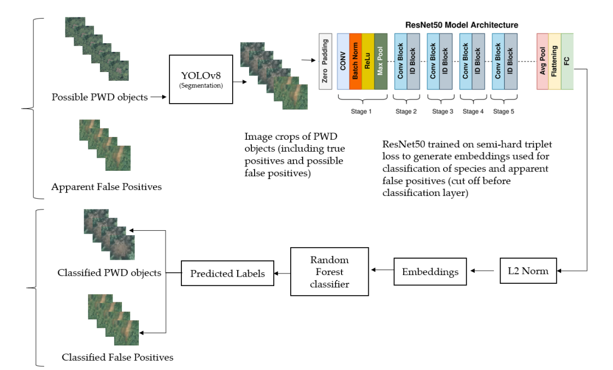

Pine Wilt Disease poses a significant global threat to forests, necessitating swift detection methods. Conventional approaches are resource-intensive but utilizing deep learning on ortho-mapped images obtained from Unmanned Aerial Vehicles offers cost-effective and scalable solutions. 

This study presents a novel method for Pine Wilt Disease detection and classification using YOLOv8 for segmenting diseased areas, followed by cropping the diseased regions from the original image and applying Deep Metric Learning for classification. 

We trained a ResNet50 model using semi-hard triplet loss to obtain embeddings, and subsequently trained a Random Forest classifier tasked with identifying tree species and distinguishing false positives.

Segmentation was favored over object detection due to its ability to provide pixel-level information, enabling the flexible extension of subsequent bounding boxes. Deep Metric Learning-based classification after segmentation was chosen for its effectiveness in handling visually similar images.

The results indicate a mean Intersection over Union of 83.12% for segmentation, with classification accuracies of 98.7% and 90.7% on the validation and test sets, respectively.

Keywords: pine wilt disease detection; segmentation; deep metric learning; forest resource monitoring; disease classification.